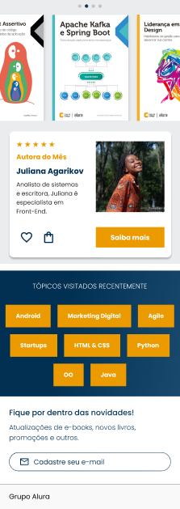

<h1> Alura Book </h1>

<h2>Desenvolvimento de uma Landing Page para o e-commerce de livros</h2>

<h2>O que aprendi: </h2>

<ul>
  <li>
    
Desenvolvimento Mobile First;

  </li>
  
  <li>
    
Criar o código HTML e CSS limpo;

  </li>
  
  <li>
    
Oraganização de pastas;

  </li>
  
  <li>
    
Tags HTML

  </li>
  
  <li>
    
Display Flex

  </li>
</ul>

<h3 align="left">O que foi utilizado: </h3>

<a>

